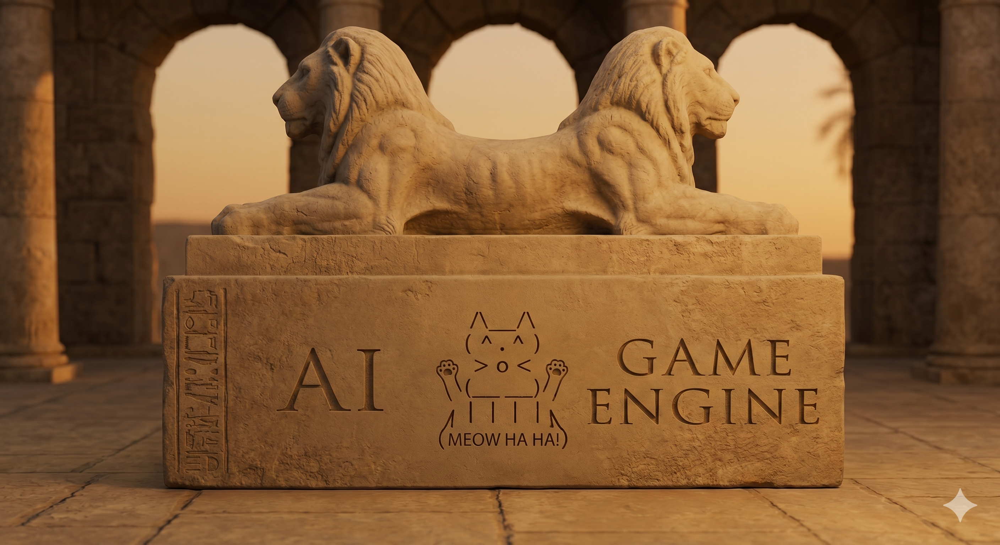
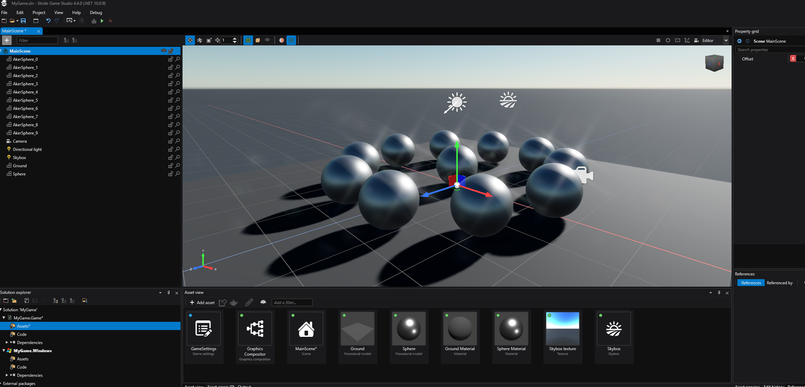
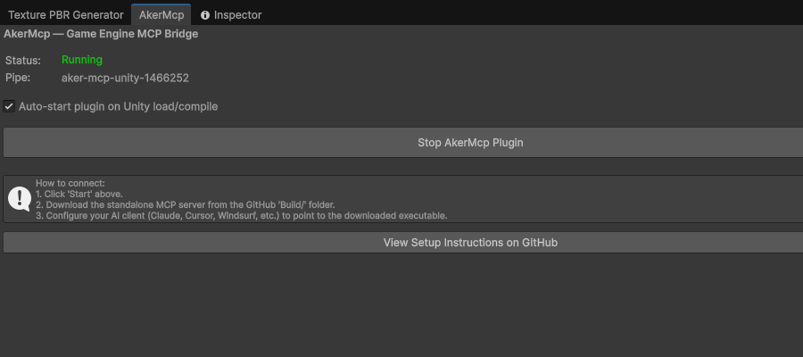

# AkerMCP


<p align="center">
  
</p>

> *Aker (Egyptian: ꜣkr) was an ancient Egyptian earth god, depicted as **two lions seated back-to-back** facing opposite horizons, Sef and Duau (Yesterday and Today), guarding the sun's safe passage through the underworld. In this architecture, Aker is the bridge: one face speaking **JSON-RPC to the LLM**, the other manipulating the **engine's main thread via IPC**.*

AkerMCP is an MCP server that lets an AI client (Claude Code, Cursor, Copilot, Antigravity, any stdio MCP client) work inside a running C# game editor: read the scene, change it with undo, run C# on the editor's main thread, take a screenshot, enter play mode and check what happened. One server and one tool set for three engines, Unity, Godot and Stride Game Studio, each behind a small adapter over the same core.

## What it does

Most engine integrations ship one hand-written tool per operation and break with every engine update. AkerMCP ships forty generic tools built on reflection and Roslyn. `inspect` shows what an object is made of, `set_property` changes any property by a dot path with undo, `query` finds objects, `execute` compiles and runs any C# against the live editor (with `using` lines and type declarations hoisted, so a helper class or a MonoBehaviour can be written and attached in one call), `take_screenshot` shows the result. The runtime loop, `enter_play`, `send_input`, `sample_state`, `assert_state` and the one-call `playtest`, runs the game and checks a mechanic against real values instead of pixels. Placeholder art and audio work the same way: the model writes a spec, the server returns a PNG or a WAV. Whatever the editor can do, the model can do, and it can see whether it worked.

```
AI: "Set the player's position to (10, 0, 5)"

-> set_property {"object_path": "/Player", "property_path": "position", "value": {"x":10,"y":0,"z":5}}
<- Property 'position' set successfully on /Player
```

### Supported engines

| Capability | Unity | Godot | Stride |
|---|:--:|:--:|:--:|
| Inspect · query · get/set property (incl. nested) | ✅ | ✅ | ✅ |
| `call_method` · `create` · `delete` (native Undo) | ✅ | ✅ | ✅ |
| `execute`: arbitrary C# via Roslyn | ✅ | ✅ | ✅ |
| Selection · console logs · recompile/compile-errors | ✅ | ✅ | ✅ |
| Scene-view screenshot **with editor gizmos** | ✅ | ✅ | ✅ |
| Platform/build tools (list · switch · build_player) | ✅ | ✅ | ✅ |
| **2D sprites from a JSON shape-spec** (`create_sprite`, rasterized server-side) | ✅ | ✅ | ✅ |
| Scene management (`new_scene` · `open_scene` · `save_scene`) | ✅ | ✅ | ✅ |
| **Runtime loop** (`enter_play`/`exit_play` · `capture_sequence` · `send_input`) | ✅ | ◑ | ◑ |

Every row is implemented and was verified live in that engine's editor. The OS window tools (`list_windows`, `capture_window`, `focus_window`) work with no engine connected.


### What it does that the others do not

The other MCP servers for game engines are tied to one engine each: unity-mcp and Unity-MCP to Unity, godot-mcp to Godot. Here one tool set covers Unity, Godot and Stride from a shared core, so what you learn driving Unity works unchanged in the other two, and Stride Game Studio is supported at all.

`execute` hoists `using` lines and type declarations, so a MonoBehaviour can be written, compiled and attached in one call instead of three. `playtest` drives input and evaluates C# assertions server-side at exact moments on the timeline, which is the only way to catch a transient as short as the top of a jump arc: separate tool calls arrive whenever the round trip lets them, and by then the frame is gone.

Then there is the asset gap. A model writes code, not pixels. `create_sprite` closes it: the model describes the shape in JSON, with ellipses, rectangles, polygons and SVG path data, plus linear gradients and per-shape opacity, and the server rasterises that to an RGBA PNG at 4x supersampling before the plugin imports it as a sprite. The vector never reaches the editor, so Godot and Stride need no SVG support of their own to get the same placeholder Unity gets. `create_sound` does the same for audio, synthesising a WAV from a jsfxr-style spec. The prototype stops waiting for someone to draw the bird.

Pair it with [LynxMCP](https://github.com/lorenzo-cambiaghi/LynxMCP) for code search over the project and its library docs: Aker is the hands, Lynx the memory.


The same request in Stride Game Studio. `execute` duplicated a sphere into a ring through Stride's asset layer, so they are real, selectable, saved entities (note `AkerSphere_*` in the hierarchy), then the editor captured itself:



### Under the hood

- A shared .NET Standard 2.1 core holds the tool logic; each engine adds an adapter that implements the engine interfaces (scene graph, editor context, code executor, play mode, input, capture). A fourth engine is another adapter; the server and the tools do not change.
- The standalone server talks JSON-RPC over stdio to the client and MessagePack over a named pipe to the plugin inside the editor, which runs every request on the engine's main thread.
- A reflection-based type system converts JSON to engine structs (`Vector3`, `Color`, `Bounds`, ...) case-insensitively, the same way for all three engines.
- Screenshots come from the editor's own render buffer with gizmos; when an adapter cannot, an OS-level capture (Windows `PrintWindow`, macOS Quartz) takes over without stealing focus.
- The server answers the MCP handshake in well under a second, connected engine or not, and sends the model its usage instructions with the tool list. See [How the model learns to use it](#how-the-model-learns-to-use-it).

Details: [Architecture](#architecture) and [Writing an Engine Adapter](#writing-an-engine-adapter).

---

## Table of Contents

- [Quick Start (Recommended)](#quick-start-recommended)
- [Connecting an AI Client](#connecting-an-ai-client)
- [Advanced: Building from Source (For Developers)](#advanced-building-from-source-for-developers)
- [Verifying the Connection](#verifying-the-connection)
- [MCP Tools](#mcp-tools)
- [MCP Resources](#mcp-resources)
- [Type System](#type-system)
- [Example Session](#example-session)
- [Architecture](#architecture)
- [Writing an Engine Adapter](#writing-an-engine-adapter)
- [Two sessions, as they happened](#two-sessions-as-they-happened)
- [How the model learns to use it](#how-the-model-learns-to-use-it)
- [Troubleshooting](#troubleshooting)
- [License](#license)

---

## Quick Start (Recommended)

Two steps: **(1)** install the adapter for your engine, Unity, Godot or Stride (they are peers; pick the one you use), then **(2)** run the standalone MCP server, which is identical for all of them and auto-discovers whichever engine is running.

### 1a. Unity Setup

> You do not need to install the .NET SDK or compile any code for Unity.

1. Go to the [latest GitHub Release](https://github.com/lorenzo-cambiaghi/AkerMCP/releases/latest) and download `AkerMCP.unitypackage`.
2. Open your Unity project and double-click the package to import it.
   *(This package already contains all necessary C# scripts, dependencies, and Roslyn compilers).*
3. **(Optional)** Open the menu **AkerMcp → Setup Test Scene** to create a ready-to-test scene.
4. Open **Window → AkerMcp** and click **Start AkerMcp Plugin**. You should see a green **Running** status.
   *(Tip: The plugin must be running before you start the server. The server discovers it automatically via a lock file).*

   

### 1b. Godot Setup

AkerMCP ships a **Godot 4.x (.NET/C#) adapter** with the **same full toolset** as Unity. Because a Godot project is a real `.csproj`, there are no DLLs to copy: references and the Roslyn engine come via NuGet/ProjectReference.

1. Download `AkerMcp.Godot-addon.zip` from the [latest Release](https://github.com/lorenzo-cambiaghi/AkerMCP/releases/latest) and extract it so you get `addons/aker_mcp/` in your Godot project (or copy this repo's `plugins/godot` folder into your project as `addons/aker_mcp`).
2. Add the AkerMcp core to your game's `.csproj` (or use the included `samples/godot` project directly; run `setup-samples` first to link the addon):
   ```xml
   <ProjectReference Include="path/to/AkerMcp.Shared.csproj" />
   <ProjectReference Include="path/to/AkerMcp.Client.csproj" />
   <PackageReference Include="Microsoft.CodeAnalysis.CSharp.Scripting" Version="4.8.0" />
   ```
   Make sure your project has `<EnableDynamicLoading>true</EnableDynamicLoading>` (required for editor plugins).
3. Build the C# solution once (**Project → Tools → C#: Create/Build**), then enable the plugin under **Project → Project Settings → Plugins → AkerMcp**.

The plugin auto-starts with the editor and pumps requests on the main thread every frame. Scene paths follow the edited scene root (e.g. `/TestScene/Box`), property paths are case-insensitive (`position.x` resolves to `Position.X`), and screenshots capture the editor's 3D viewport. The standalone MCP server discovers the Godot plugin automatically, with no server changes.

### 1c. Stride Setup

AkerMCP ships a **Stride (Game Studio) adapter** with the **same full toolset**, including undoable edits via Stride's Quantum graph, `execute` (Roslyn), real Scene-view screenshots (editor back-buffer, with gizmos), and the platform/build tools (`dotnet build` per executable project).

> Stride support runs as a Game Studio editor plugin. Game Studio has no third-party plugin discovery, so AkerMcp registers itself with one tiny bootstrap. Pick the path that matches how you got Stride.

#### Option A (recommended): Stride installed from the Launcher, official binaries, no Stride rebuild

A per-launch wrapper injects the plugin **only into the Game Studio process it starts**, via the .NET runtime's `DOTNET_STARTUP_HOOKS`. The variable is never written to your user/machine environment, so it cannot affect any other .NET app; if the plugin DLL is ever missing, the wrapper just launches Game Studio without AkerMcp.

```powershell
# one-time, from the repo root
.\install-stride-wrapper.ps1 -GameStudioPath "C:\path\to\Stride.GameStudio.exe"
# (omit -GameStudioPath to auto-detect a Launcher install)
```

This builds the adapter against your installed Game Studio, drops it into `<GameStudio>/AkerMcpPlugins`, and creates a **"Stride Game Studio (AkerMCP)"** shortcut (Desktop + Start Menu). Launch Stride from that shortcut and **open a project + scene**; the pipe server starts automatically. Your official Stride shortcut keeps launching Game Studio untouched. Remove everything with `.\install-stride-wrapper.ps1 -Uninstall`.

#### Option B: you build Stride Game Studio from source

The adapter loads in-process via a drop-in loader patched into Game Studio itself (no wrapper needed).

1. Build **Stride Game Studio** from source (the adapter references its editor assemblies). See the [Stride build docs](https://github.com/stride3d/stride).
2. Add a drop-in plugin loader to `Stride.GameStudio/Program.cs` (right after the built-in plugins are registered) so Game Studio loads any adapter placed in an `AkerMcpPlugins` folder next to `Stride.GameStudio.exe`:
   ```csharp
   var akerPluginsDir = System.IO.Path.Combine(System.AppContext.BaseDirectory, "AkerMcpPlugins");
   if (System.IO.Directory.Exists(akerPluginsDir))
       foreach (var dll in System.IO.Directory.GetFiles(akerPluginsDir, "*.dll"))
           try { foreach (var t in System.Reflection.Assembly.LoadFrom(dll).GetTypes())
                     if (!t.IsAbstract && typeof(AssetsPlugin).IsAssignableFrom(t) && t.GetConstructor(System.Type.EmptyTypes) != null)
                         AssetsPlugin.RegisterPlugin(t); }
           catch { /* skip incompatible DLLs */ }
   ```
3. Build + deploy the adapter into Game Studio with `setup-stride.ps1` (set `-StrideBin` to your Game Studio build output), then launch Game Studio and **open a project + scene**; the plugin starts the pipe server when a project opens.

Either way, the standalone MCP server then discovers the Stride engine automatically, the same as Unity and Godot.

### 2. MCP Server Setup
1. Go to the [latest GitHub Release](https://github.com/lorenzo-cambiaghi/AkerMCP/releases/latest).
2. Download the standalone server for your OS (`AkerMcp.Server-win-x64.zip`, `-osx-x64.zip`, or `-linux-x64.zip`).
3. Extract the archive anywhere on your computer.

---

## Connecting an AI Client

Point your AI client to the standalone executable you extracted in Step 2. 

> **Important:** Make sure the Unity plugin is running (green status in the AkerMcp window) before using any tools from the AI client.

### Claude Code (CLI)

```bash
claude mcp add game-engine -- /absolute/path/to/extracted/AkerMcp.Server
```

### Claude Desktop / Cursor / Windsurf

Open the MCP settings (or `claude_desktop_config.json`) and add the server:

```json
{
  "mcpServers": {
    "game-engine": {
      "command": "/absolute/path/to/extracted/AkerMcp.Server",
      "args": []
    }
  }
}
```

> **Windows users:** Replace the command path with the full Windows path to the `.exe`, for example `"C:\\Tools\\AkerMcp.Server\\AkerMcp.Server.exe"`. Remember to use double backslashes in JSON!

### Google Antigravity

Antigravity reads `mcp_config.json` from its user-data directory (`~/.gemini/antigravity/` or `%USERPROFILE%\.gemini\antigravity\`). Add:

```json
{
  "mcpServers": {
    "game-engine": {
      "command": "C:/Tools/AkerMcp.Server/AkerMcp.Server.exe",
      "args": [],
      "type": "stdio"
    }
  }
}
```

### VS Code + Copilot

Add to your `.vscode/settings.json` or use the **MCP: Add Server** command:

```json
{
  "mcp": {
    "servers": {
      "game-engine": {
        "command": "C:\\Tools\\AkerMcp.Server\\AkerMcp.Server.exe",
        "args": []
      }
    }
  }
}
```

### Alternative: Running from Source (For Developers)

If you cloned the repository or prefer running via the .NET SDK instead of using the standalone binaries, use `dotnet run`. This is often necessary if you are actively modifying the MCP server code.

**CLI command:**
```bash
claude mcp add game-engine -- dotnet run --project /absolute/path/to/AkerMCP/Server -c Release --verbosity quiet --nologo
```

**JSON Configuration (for Claude Code config, Cursor, Antigravity, etc):**
```json
{
  "mcpServers": {
    "game-engine": {
      "type": "stdio",
      "command": "dotnet",
      "args": [
        "run",
        "--project",
        "C:/absolute/path/to/AkerMCP/Server",
        "-c",
        "Release",
        "--verbosity",
        "quiet",
        "--nologo"
      ]
    }
  }
}
```

---

## Advanced: Building from Source (For Developers)

If you want to modify AkerMCP or test the included Unity project, you'll need the **.NET 8.0+ SDK**.

### Step 1: clone and build
```bash
git clone https://github.com/lorenzo-cambiaghi/AkerMCP.git
cd AkerMCP
dotnet build -c Release
dotnet publish Shared/AkerMcp.Shared.csproj -c Release -o .publish
```

### Step 2: Unity plugin setup
If you are modifying the source code and want to push changes to your own Unity project:
1. Copy this repo's `plugins/unity` folder into your own Unity project as `Assets/AkerMcp`.
2. Create `Assets/AkerMcp/Plugins/` and copy all `.dll` files from `.publish/` and `Client/bin/Release/netstandard2.1/`.
3. Copy the Unity Roslyn Compilers (`Microsoft.CodeAnalysis.dll`, etc.) from your Unity Editor installation (`.../Editor/Data/MonoBleedingEdge/lib/mono/4.5/`) into the `Plugins/` folder.

If you just want to run the included sample, run `./setup-samples.sh` (or `setup-samples.bat` on Windows) once to link the plugin into `samples/unity`, then `./copy-dlls.sh` (or `copy-dlls.bat`) to build and copy all dependencies. Open `samples/unity` in Unity.

### Packaging a Release
On Windows, `.\publish-release.ps1 -Version v1.2.3` does the whole release in one command: builds the packages (Unity must be closed), tags the commit, creates the [GitHub Release](https://github.com/lorenzo-cambiaghi/AkerMCP/releases) and uploads the five artifacts via the GitHub API (auth via `GITHUB_TOKEN` or the stored git credential). Use `-DryRun` to preview, `-SkipBuild` to reuse existing `Build/` output.

The six release artifacts are: `AkerMCP.unitypackage` (Unity plugin), `AkerMcp.Godot-addon.zip` (Godot addon; extract into your project's `addons/`), `AkerMcp.Stride-source.zip` (Stride adapter **source** + `install-stride-wrapper.ps1`; build it against your Game Studio per [1c. Stride Setup](#1c-stride-setup); it is not a prebuilt binary because it links your specific Stride editor assemblies), and the three standalone server builds (`AkerMcp.Server-{win,osx,linux}-x64.zip`).

Alternatively, run `build-package.bat` (Windows) or `./build-package.sh` (Mac/Linux) to only produce the artifacts in the local `Build/` folder (gitignored), then upload them as release assets manually. Binaries are distributed via Releases, not committed to the repository.

---

## Verifying the Connection

Once both the Unity plugin and an AI client are running, you can verify the connection:

1. **In Unity**: the AkerMcp window should show **Running** (green)
2. **In the AI client**: ask the AI to use the `inspect` tool:

```
"Inspect the scene hierarchy"
```

You should get back a tree of objects with their components:

```
Player  [Transform, Rigidbody]
  PlayerCamera  [Transform, Camera]
Enemy_1  [Transform, MeshFilter, MeshRenderer, BoxCollider, Rigidbody]
Enemy_2  [Transform, MeshFilter, MeshRenderer, BoxCollider, Rigidbody]
Ground  [Transform, MeshFilter, MeshRenderer, MeshCollider]
```

If you see this, everything is working.

---

## MCP Tools

Every tool definition rides in your client's context on every turn, so the set is layered. `core` (14 tools, about 2,300 tokens of definitions) is inspect, edit, execute, screenshot, logs and compile. `standard` (27 tools, about 4,100 tokens, the default) adds scripts, scenes, play control, the engine pin and the OS window tools that unblock a modal dialog. `full` (40 tools, about 6,800 tokens) adds sprite and sound authoring, the verification tools, `playtest` and the build pipeline. Pick one with `--profile core` in the server's arguments or `AKER_MCP_PROFILE=core` in its environment; `AKER_MCP_TOOLS_INCLUDE=playtest,build_player` adds single tools to a profile and `AKER_MCP_TOOLS_EXCLUDE` removes them. A call to a hidden tool answers with the profile that hid it and how to load it, and the handshake instructions list the hidden ones, so the model asks instead of guessing.

Every tool carries the four MCP hints (read-only, destructive, idempotent, open-world), so a client can auto-approve the reads and ask before `delete`, `execute`, `call_method`, `send_input`, `write_script`, `new_scene`, `open_scene`, `switch_build_target` and `build_player`.

### Scene

| Tool | Profile | What it does |
|------|---------|--------------|
| `inspect` | core | Components, properties, methods and children of a scene object or of a type; `depth`, `include_methods`, `filter` |
| `get_property` | core | Read one property by dot path (`position`, `Rigidbody.mass`, `MeshRenderer.material.color.r`) |
| `set_property` | core | Set one property by dot path, with undo; structs as JSON objects |
| `call_method` | core | Invoke a method on a scene object or a static member of a type; string arguments, converted |
| `query` | core | Find objects by type, name glob or regex, tag or property values |
| `create` | core | Add an object with a type, name, optional parent and initial properties, with undo |
| `delete` | core | Remove an object, with undo; `recursive: false` keeps its children |
| `select` | core | Select an object in the editor; it becomes `selectedObject` in `execute` |
| `get_selection` | core | What the user has selected: path, components, property summary |

### Development workflow

| Tool | Profile | What it does |
|------|---------|--------------|
| `refresh_scripts` | core | Compile pending script changes and return errors and warnings; blocks through Unity's domain reload |
| `get_compile_errors` | core | The last compilation's result without recompiling |
| `get_console_logs` | core | Recent console entries, filtered by level or text |
| `execute` | core | Run any C# on the engine's main thread through Roslyn and return its value; globals `selectedObject`, `Find`, `FindAll<T>`, `Create`, `Log` |
| `take_screenshot` | core | JPEG of the Game view (default) or the Scene view with gizmos |
| `write_script` | standard | Write a source file into the project by a path relative to its root, wherever the server runs |
| `engine_status` | standard | Which engine answers, which others run, and a pin that survives reconnects |

### Scene and 2D authoring

| Tool | Profile | What it does |
|------|---------|--------------|
| `new_scene` | standard | A fresh scene, 2D by default, optionally saved to an asset path |
| `open_scene` | standard | Open a scene by its engine asset path |
| `save_scene` | standard | Save the edited scene in place or to a path |
| `create_sprite` | full | Author a flat, geometric shape-spec; the server rasterises it to a PNG and imports it as a sprite on any engine |
| `create_sound` | full | Synthesise a short jsfxr-style sound and import it as an audio clip |
| `add_primitive` | full | Write a vetted gameplay script (2D platformer controller, auto-runner, camera follow, kill zone, score overlay) |

> **Engine support:** all three engines implement these. `create_sprite` imports + places a sprite on **Unity** and **Godot**; on **Stride** it persists a real `.sdtex` texture asset in the package (via the editor's `SessionViewModel`) and also adds a runtime preview entity for immediate visibility. `new_scene`/`open_scene`/`save_scene` work on **Unity** and **Godot** (file-on-disk scenes) and on **Stride** (package-managed `SceneAsset` via the editor). `write_script` works on all three. *(Stride's `create_sprite` + scene creation are verified live in Game Studio.)*

**`create_sprite` shape-spec**: drawn in order (painter's): `ellipse`, `rect` (with `rx` for rounded corners), `polygon`, `line`/`polyline`, and `path` (an SVG path-data subset). Each shape takes a `fill` (hex or linear `gradient`), optional `stroke`/`strokeWidth`, and `opacity`. Example (a flat bird placeholder):

```json
{
  "name": "bird", "pixels_per_unit": 64, "pivot": {"x":0.5,"y":0.5},
  "scene_path": "/World", "position": {"x":-3,"y":0,"z":0},
  "spec": { "width":64, "height":64, "shapes": [
    {"type":"ellipse","cx":31,"cy":34,"rx":23,"ry":21,"fill":"#FFC107","stroke":"#C98A00","strokeWidth":2},
    {"type":"polygon","points":[[52,29],[64,33],[52,38]],"fill":"#FF8C00"} ] }
}
```

> Keep placeholders flat and geometric: recognizable silhouette over detail. For arbitrary SVG (boolean paths, filters, tracing) a dedicated vector tool would be the right home; `create_sprite` deliberately targets the clean-prototype niche.

### Runtime loop

| Tool | Profile | What it does |
|------|---------|--------------|
| `enter_play` / `exit_play` | standard | Run the project and stop it; Unity's domain reload and reconnect are handled |
| `get_play_state` | standard | Playing, paused, time, frame counter; read twice to tell a frozen game from a live one |
| `set_play_pause` | standard | Pause or resume |
| `send_input` | standard | Inject key, mouse button and mouse move events into the running game (`window_title` for a game in its own window) |
| `play_step` | full | Advance frames while paused |
| `capture_sequence` | full | Several screenshots at an interval, returned as a strip, to see motion |

> **Engine support:** the runtime loop is backed by the optional `IPlayModeController` (play control) and the optional `IInputSimulator` (in-process input, with an OS-level fallback). Support is honest per engine:
> - **Unity**, full: Play Mode runs in the Game View, so `take_screenshot`/`capture_sequence` capture the live game; pause/step supported. Reuses the domain-reload reconnect from `refresh_scripts`.
> - **Godot**, partial: the game runs in a **separate window** (screenshot it with `capture_window`, drive it with `send_input`'s OS-level path + `window_title`); no editor-side pause/step.
> - **Stride**: Game Studio has no plugin-controllable Play Mode; `enter_play` reports this and points you to `build_player` + running the produced executable.
> - **SkelForge**, full: "play" plays the animation timeline in-editor; pause + frame-step supported; the viewport shows the pose.
>
> `send_input` prefers an engine's in-process `IInputSimulator`, otherwise focuses the game/engine window and injects via **OS-level `SendInput`** (Windows; macOS/Linux report unsupported). On **Unity** the in-process path drives the **new Input System** (`com.unity.inputsystem`) directly, resolved via reflection, so there is no hard package dependency; projects on the legacy Input Manager (or without the package) fall back to OS-level automatically. On **Godot/Stride** the game is a separate window, so pass `window_title` (the game window's title) or the OS-level path targets the editor. The `action` event type is reserved but not yet injectable; drive the key/mouse controls the action is bound to.

### Verify and iterate

| Tool | Profile | What it does |
|------|---------|--------------|
| `sample_state` | full | Evaluate C# expressions in the running game and return their values |
| `assert_state` | full | Compare runtime expressions to expected values with `==`, `<`, `approx`, `truthy` and friends, polled until they hold |
| `playtest` | full | One call: enter play, run a timed list of input, wait, capture, assert and sample steps, check the final criteria, exit play; returns one verdict with frames and evidence |

### Platform and build

| Tool | Profile | What it does |
|------|---------|--------------|
| `list_platforms` | full | The build platforms the engine knows, flagged active and buildable |
| `get_platform_settings` / `set_platform_settings` | full | Read and change a platform's build and player settings as a key-value map |
| `switch_build_target` | full | Make a platform the active target |
| `build_player` | full | Build the project for a platform and return a report |

> Engine differences are handled gracefully: e.g. Godot and Stride have no global active target, so `switch_build_target` reports that and you pass the platform directly to `build_player`.

### Windows on the server's machine

| Tool | Profile | What it does |
|------|---------|--------------|
| `list_windows` | standard | Visible top-level windows: title, process, pid; works with no engine connected |
| `capture_window` | standard | Screenshot any window by a title substring, occluded or not, without stealing focus |
| `focus_window` | standard | Bring a window to the foreground, restoring it if minimised |

These three are how the model recovers from a modal dialog that blocks the editor's main thread, and how it screenshots a Godot game that runs in its own window.

#### How `take_screenshot` works

The tool follows a **hybrid capture strategy** that prefers quality but always succeeds:

1. **Engine-internal path** *(implemented by all three adapters)*: captures the Scene view directly from the editor's render buffer **including gizmos** (Unity `GrabPixels`, Godot viewport, Stride editor back-buffer via `Texture.Save`). Works even when the editor window is occluded or partially off-screen. Highest quality.
2. **OS-level fallback** *(automatic, cross-platform on Windows + macOS)*: captures the engine's main window without stealing foreground focus. Works for any C# engine without requiring adapter code. Per-OS implementation is selected at runtime:
   - **Windows**: Win32 `PrintWindow(PW_RENDERFULLCONTENT)` via `user32.dll`
   - **macOS**: Quartz `CGWindowListCreateImage` via `CoreGraphics.framework` + `ImageIO.framework`. Window discovery: enumerates on-screen windows owned by the engine PID; among those, prefers any whose title contains the engine name (anywhere; it matches both "Unity 6000…" and "… Godot Engine") and within that subset picks the largest by area. If no title contains the engine name, falls back to the largest PID-owned window
   - **Linux**: not implemented; the engine adapter must implement `IScreenCapture`

Output is automatically (cross-platform via ImageSharp):
- **Resized** to a maximum of 1920px on the longest side
- **Re-encoded as JPEG** (quality 85)

Typical output size: **~150-400 KB**, comfortably under Claude API image limits (~5 MB).

**Parameters:**

```json
{ "view": "game" }   // default: captures the Game View
{ "view": "scene" }  // captures the active Scene View with gizmos (Unity / Godot / Stride)
```

**Example:**

```
→ set_property {"object_path": "/Player", "property_path": "Light.color", "value": {"r":1,"g":0,"b":0,"a":1}}
← Property 'Light.color' set successfully on /Player

→ take_screenshot {"view": "scene"}
← [JPEG image, 1920×1080, 287 KB]   // AI now sees the red light
```

#### macOS: Screen Recording permission

On macOS 10.15+, capturing windows from another process requires **Screen Recording permission** for the binary running the AkerMcp server. This affects only the OS-level path (`capture_window` and the `take_screenshot` fallback); the engine-internal `IScreenCapture` path (implemented by all three engine adapters) works without any permission grant.

**First-time setup:**

1. The first time the OS-level fallback is invoked, macOS shows a permission prompt for the binary running the server (typically `dotnet`).
2. If you miss the prompt or denied it, open: **System Settings → Privacy & Security → Screen Recording**
3. Add (or enable the toggle for) the binary running AkerMcp:
   - If you launch via `dotnet run --project Server` → the entry is `dotnet` (or `dotnet [version]`)
   - If you ship a self-contained build → the entry is your published executable
4. **Restart the server.** macOS caches the denial decision until the process restarts; granting alone is not enough.

**Verification:**

```bash
# Trigger a screenshot from your AI client. If permission is missing, the tool returns:
#   "macOS denied the screen capture (CGWindowListCreateImage returned NULL)..."
# Follow the steps above and try again after restarting the server.
```

**Why no permission is needed for Unity (and most engines):** The Unity adapter implements `IScreenCapture` using its own Camera/SceneView render buffer. That happens entirely *inside* the Unity process, so macOS doesn't treat it as cross-process screen capture and no permission is required. Only when no adapter capture exists does AkerMcp fall back to the OS-level path that triggers the permission flow.

### Dynamic Code Execution (`execute`)

The `execute` tool runs arbitrary C# code inside the live editor, **Unity, Godot or Stride**, using Roslyn. This is the most powerful tool: it can do anything that engine's editor API allows, with no fixed tool surface.

**What it enables:**

- Procedural scene generation (spawn 100 objects in a grid, create terrain, etc.)
- Bulk property modifications across many objects
- Asset manipulation (create materials, import textures, modify prefabs)
- Complex queries that go beyond what `query` supports
- Editor automation (menu items, build pipeline, custom importers)
- Anything you can do in an editor script for that engine

**Built-in globals** available in your code *(shown for the Unity adapter; the Godot and Stride adapters expose equivalent globals over their own `Node` / `Entity` types)*:

| Global | Type | Description |
|--------|------|-------------|
| `selectedObject` | `GameObject?` | Currently selected GameObject in the editor |
| `Find(name)` | `GameObject?` | Shortcut for `GameObject.Find(name)` |
| `FindAll<T>()` | `T[]` | Find all objects of type T |
| `Create(name)` | `GameObject` | Create a new empty GameObject |
| `Log(message)` | `void` | Log to the Unity console |

**Imported namespaces** (no `using` needed): `System`, `System.Collections.Generic`, `System.Linq`, plus the engine's namespaces: `UnityEngine`/`UnityEditor` (Unity), `Godot` (Godot), `Stride.Engine`/`Stride.Core.Mathematics` (Stride).

Need another namespace? Add `using ...;` directives at the **top** of the snippet; they are hoisted to file scope automatically (e.g. `using System.IO;`).

**Declaring types works too.** A snippet is wrapped as a method body, but `class`, `struct`, `interface`, `enum`, `record` and `delegate` declarations are lifted to file scope before compiling, so helper classes, fake implementations of an interface, callback receivers and `MonoBehaviour`s you then `AddComponent` all work directly, with no reflection workarounds. Access modifiers are adjusted for you (`private class Foo` is accepted), and local functions inside the body keep working as usual.

**Examples** (Unity-flavored; the same patterns apply with each engine's API):

```csharp
// Create a grid of cubes
for (int x = 0; x < 5; x++)
    for (int z = 0; z < 5; z++) {
        var cube = GameObject.CreatePrimitive(PrimitiveType.Cube);
        cube.name = $"Cube_{x}_{z}";
        cube.transform.position = new Vector3(x * 2, 0, z * 2);
    }
```

```csharp
// Set all enemies to red
var enemies = FindAll<Renderer>()
    .Where(r => r.gameObject.name.StartsWith("Enemy"))
    .ToArray();
foreach (var r in enemies)
    r.material.color = Color.red;
return $"Colored {enemies.Length} enemies";
```

```csharp
// Return scene stats
var objects = FindAll<GameObject>();
var types = objects
    .SelectMany(go => go.GetComponents<Component>())
    .Where(c => c != null)
    .GroupBy(c => c.GetType().Name)
    .Select(g => $"{g.Key}: {g.Count()}")
    .ToArray();
return string.Join("\n", types);
```

> **Note:** Each `execute` call is compiled and run independently: variables do **not** persist between calls, so every script must be self-contained. The evaluator runs on Unity's main thread with full Editor API access; `Debug.Log` output produced during the run is captured and returned in the `output` field.

### How property paths work

Properties are accessed via **dot-notation paths** resolved at runtime through reflection:

```
transform.position.x          → float
Rigidbody.mass                → float (targets a specific component)
MeshRenderer.material.color   → Color
```

When a property name is ambiguous (e.g. `enabled` exists on multiple components), prefix it with the component type: `Rigidbody.enabled`, `MeshRenderer.enabled`.

---

## MCP Resources

| URI | Description |
|-----|-------------|
| `aker://guide` | The usage playbook as markdown: workflow, property paths, `execute` rules, screenshots, recovery. Served by the server, no engine needed |
| `scene://hierarchy` | Full scene tree with components listed per object |
| `project://info` | Engine name/version, project path, active scene |
| `editor://logs` | Recent console entries |
| `editor://compile_status` | Compilation status, error/warning counts |
| `engine://types` | Registered engine type names |

---

## Type System

The serializer converts between JSON and .NET types via reflection. It handles:

- **Primitives**: `int`, `float`, `double`, `bool`, `string`, `enum`
- **Structs**: any value type, constructed from JSON via field/property matching
- **Arrays**: `T[]` from JSON arrays
- **Lists**: `List<T>` from JSON arrays
- **Dictionaries**: `Dictionary<string, T>` from JSON objects
- **Nested types**: recursive resolution (e.g. `Bounds` containing `Vector3` fields)
- **Nullable**: automatic unwrap

The Unity adapter registers optimized converters for:

```
Vector2  Vector3  Vector4  Vector2Int  Vector3Int
Quaternion  Color  Color32  Rect  RectInt
Bounds  BoundsInt  LayerMask
```

JSON examples:

```json
{ "x": 1.0, "y": 2.0, "z": 3.0 }                                              // Vector3
{ "r": 0.5, "g": 0.0, "b": 1.0, "a": 1.0 }                                    // Color
{ "center": { "x": 0, "y": 0, "z": 0 }, "size": { "x": 10, "y": 10, "z": 10 }} // Bounds
[{ "x": 0, "y": 0, "z": 0 }, { "x": 1, "y": 1, "z": 1 }]                      // Vector3[]
```

---

## Example Session

```
→ inspect {"target": "/Player"}
← {
    "typeName": "Rigidbody",
    "path": "/Player",
    "components": [
      {"name": "Transform", "enabled": true},
      {"name": "Rigidbody", "enabled": true}
    ],
    "properties": [
      {"name": "position", "type": "Vector3", "value": {"x":0,"y":1,"z":0}},
      {"name": "Rigidbody.mass", "type": "float", "value": 1.0},
      ...
    ],
    "childNames": ["PlayerCamera"]
  }

→ select {"object_path": "/Player/PlayerCamera"}
← {"selected": true, "path": "/Player/PlayerCamera", "name": "PlayerCamera",
    "components": [{"name":"Transform"}, {"name":"Camera"}]}

→ set_property {
    "object_path": "/Player",
    "property_path": "position",
    "value": {"x": 10, "y": 0, "z": 5}
  }
← Property 'position' set successfully on /Player

→ query {"type_filter": "Camera"}
← [{"path": "/Player/PlayerCamera", "type": "Camera", "name": "PlayerCamera"}]

→ refresh_scripts {}
← Recompilation requested. Status: idle
  Last compile: 14:32:05
  Result: SUCCESS
  No errors or warnings.

→ get_console_logs {"level_filter": "error", "count": 10}
← (No matching log entries)
```

---

## Architecture

```
                  ┌──────────────────────┐
                  │  LLM (Claude, etc.)  │
                  └──────────┬───────────┘
                             │ JSON-RPC 2.0 / stdio
                  ┌──────────▼───────────┐
                  │    AkerMCP Server    │   .NET 8 console process
                  │   20+ MCP tools      │
                  │    5 MCP resources   │
                  └──────────┬───────────┘
                             │ Named Pipe + MessagePack
                  ┌──────────▼───────────┐
                  │   Engine Plugin      │   runs inside Unity / Godot / Stride / Flax
                  │   ISceneGraph impl   │
                  └──────────────────────┘
```

| Project | Target | Description |
|---------|--------|-------------|
| `AkerMcp.Shared` | netstandard2.1 | Protocol models, engine abstractions, reflection engine, serialization, IPC |
| `AkerMcp.Server` | net8.0 | MCP server: JSON-RPC over stdio, routes tool calls to the engine plugin |
| `AkerMcp.Client` | netstandard2.1 | Plugin base class: runs inside the engine, handles IPC and main-thread dispatch |

### How it works

1. The **engine plugin** starts a named-pipe server and writes a lock file to the system temp directory.
2. The **MCP server** scans for lock files, connects to the pipe, and begins forwarding tool calls.
3. The **LLM** sends JSON-RPC requests over stdio. The server forwards them to the engine plugin via MessagePack IPC and returns results as JSON.
4. The **engine plugin** dispatches requests to the main thread, executes reflection-based operations through `ISceneGraph`/`ISceneNode`, and returns results.

Property paths like `transform.position.x` are resolved at runtime by `PropertyPathResolver`, which walks the object graph via cached reflection metadata. Struct value-type propagation is handled automatically.

### Project structure

```
AkerMCP/
├── AkerMcp.sln
├── Shared/                              AkerMcp.Shared (netstandard2.1)
│   ├── Protocol/                        JSON-RPC and MCP message models
│   ├── Abstraction/                     Engine-agnostic interfaces
│   ├── Reflection/                      PropertyPathResolver, inspector, cache
│   ├── Serialization/                   GenericSerializer, TypeRegistry
│   └── Ipc/                             Named pipe channel, binary framing
├── Server/                              AkerMcp.Server (net8.0 console app)
│   ├── McpServer.cs                     JSON-RPC dispatcher, MCP lifecycle
│   ├── ToolRegistry.cs                  40 tool registrations, handlers, profile pruning
│   ├── ToolDocs.cs                      every tool description, in one place
│   ├── ToolProfiles.cs                  core / standard / full
│   ├── ToolAnnotationTable.cs           the four MCP hints per tool
│   ├── ServerInstructions.cs            handshake instructions + the aker://guide resource
│   ├── ResourceRegistry.cs              6 resources, incl. the aker://guide playbook
│   ├── EngineConnection.cs              IPC client to engine plugin
│   ├── StdioTransport.cs                stdin/stdout transport
│   ├── ImageProcessor.cs                Resize + JPEG normalization (cross-platform via ImageSharp)
│   ├── SpriteRasterizer.cs              shape-spec → RGBA PNG (pure-managed ImageSharp.Drawing) for create_sprite
│   └── Platform/                        OS-level window capture
│       ├── IPlatformScreenCapture.cs    Common interface
│       ├── PlatformScreenCapture.cs     Runtime OS-based factory
│       ├── Windows/
│       │   └── WindowsScreenCapture.cs  Win32 PrintWindow + GDI+
│       └── Mac/
│           └── MacScreenCapture.cs      Quartz CGWindowListCreateImage + ImageIO P/Invoke
├── Client/                              AkerMcp.Client (netstandard2.1)
│   ├── EnginePluginBase.cs             Abstract base for adapters
│   ├── IpcRequestHandler.cs            Request routing and execution
│   ├── PluginDiscovery.cs              Lock-file based auto-discovery
│   ├── MainThreadDispatcherBase.cs     Thread-safe queue with TCS pattern
│   └── ClientConfiguration.cs          Client-side settings
├── plugins/                            Canonical engine adapters (the shippable plugins)
│   ├── unity/                          Unity adapter (→ Assets/AkerMcp in-project)
│   │   ├── UnitySceneGraph.cs           Scene traversal and node creation
│   │   ├── UnitySceneNode.cs            Reflection wrapper for GameObjects
│   │   ├── UnityTypeRegistration.cs     MessagePack types and aliases
│   │   └── Editor/                      Editor-only tooling
│   │       ├── DynamicEvaluatorV2.cs    Roslyn-powered C# execution engine
│   │       ├── McpEditorWindow.cs       Unity Editor UI for MCP server
│   │       ├── UnityCompilationSupport.cs Script compilation tools
│   │       ├── UnityEditorContext.cs    Active selection and console logs
│   │       ├── UnityMainThreadDispatcher.cs Unity main thread marshalling
│   │       ├── UnityScreenCapture.cs    Game/Scene view render-buffer capture
│   │       └── UnityMcpPlugin.cs        Plugin entry point
│   ├── godot/                          Godot 4.x (.NET) adapter (→ addons/aker_mcp in-project)
│       ├── AkerMcpEditorPlugin.cs       [Tool] EditorPlugin entry + main-thread pump
│       ├── GodotMcpPlugin.cs            EnginePluginBase subclass
│       ├── GodotSceneGraph.cs           Edited-scene traversal and node creation
│       ├── GodotSceneNode.cs            Reflection wrapper for Nodes (no components)
│       ├── GodotCapabilities.cs         Type resolution and engine metadata
│       ├── GodotTypeRegistration.cs     Vector/Color/Rect2/Aabb converters
│       ├── GodotMainThreadDispatcher.cs Queue drained by EditorPlugin._Process
│       ├── GodotEditorContext.cs        Selection, scene I/O, log buffer
│       ├── GodotCompilationSupport.cs   `dotnet build` + MSBuild diagnostics
│       ├── GodotScreenCapture.cs        Editor viewport capture
│       └── GodotCodeExecutor.cs         Roslyn-powered C# execution engine
│   └── stride/                         Stride (Game Studio) adapter (.csproj + sources)
│       ├── StrideMcpPlugin.cs           AssetsPlugin entry (Game Studio hook)
│       ├── StrideBootstrap.cs           Idempotent Register(), shared by both loaders
│       ├── StrideEnginePlugin.cs        EnginePluginBase (composed; hosts the IPC server)
│       ├── StrideSceneGraph.cs          Live edited-scene traversal
│       ├── StrideSceneNode.cs           Reflection wrapper for Entities + components
│       ├── StrideSceneBridge.cs         Quantum writes (undo) + editor-game access
│       ├── StrideCapabilities.cs        Type resolution and engine metadata
│       ├── StrideMainThreadDispatcher.cs WPF Dispatcher marshalling
│       ├── StrideEditorContext.cs       Selection + GlobalLogger console capture
│       ├── StrideCompilationSupport.cs  `dotnet build` + MSBuild diagnostics
│       ├── StrideScreenCapture.cs       Scene-view back-buffer capture (Texture.Save)
│       ├── StrideBuildManager.cs        Platform/build (executable projects)
│       └── StrideCodeExecutor.cs        Roslyn-powered C# execution engine
│   ├── stride-startuphook/             DOTNET_STARTUP_HOOKS bootstrap (binary-install path)
│   │   └── StartupHook.cs               Registers the adapter once Game Studio loads
│   └── stride-launcher/                Per-launch wrapper (sets the hook for the GS child only)
│       └── Program.cs                   Starts ../Stride.GameStudio.exe with the hook injected
├── samples/                            Minimal harness projects (open in the editor)
│   ├── unity/                          Unity project; Assets/AkerMcp → junction to plugins/unity
│   └── godot/                          Godot project; addons/aker_mcp → junction to plugins/godot
└── setup-samples.bat / .sh             Recreates the sample junctions after a clone
```

> The plugins under `plugins/` are the canonical, shippable source. The `samples/` projects are thin shells that link the plugin in via a directory junction (created by `setup-samples`), so there is a **single copy** of each adapter; the editor edits it in place. The junctions are gitignored; run `setup-samples` once after cloning.

---

## Writing an Engine Adapter

To support a new engine (e.g. Godot, Stride, Flax), subclass `EnginePluginBase` and implement the required interfaces:

```csharp
public class MyEnginePlugin : EnginePluginBase
{
    // Required
    protected override ISceneGraph CreateSceneGraph() => new MySceneGraph();
    protected override IEngineCapabilities CreateCapabilities() => new MyCapabilities();
    protected override IMainThreadDispatcher CreateDispatcher() => new MyDispatcher();

    // Optional
    protected override IEditorContext? CreateEditorContext() => new MyEditorContext();
    protected override IAssetManager? CreateAssetManager() => null;
    protected override ICompilationSupport? CreateCompilationSupport() => new MyCompilationSupport();
    protected override IScreenCapture? CreateScreenCapture() => new MyScreenCapture();
    protected override ISpriteImporter? CreateSpriteImporter() => new MySpriteImporter();
    protected override ISceneManager? CreateSceneManager() => new MySceneManager();
    protected override IPlayModeController? CreatePlayModeController() => new MyPlayModeController();
    protected override IInputSimulator? CreateInputSimulator() => new MyInputSimulator();

    protected override void Log(string message) { /* ... */ }
    protected override void LogError(string message) { /* ... */ }
}
```

| Interface | Purpose | Required |
|-----------|---------|:--------:|
| `ISceneGraph` | Scene tree traversal, create/delete, query | Yes |
| `ISceneNode` | Property get/set, method invocation, component listing | Yes |
| `IEngineCapabilities` | Type resolution, engine metadata | Yes |
| `IMainThreadDispatcher` | Marshal actions to the engine's main thread | Yes |
| `IEditorContext` | Selection, scene management, console logs | No |
| `IAssetManager` | Asset search, load, save, delete | No |
| `ICompilationSupport` | Script recompilation, error retrieval | No |
| `IScreenCapture` | Engine-internal render-buffer capture (Game/Scene view) | No; falls back to OS-level capture on Windows (`PrintWindow`) and macOS (Quartz). On Linux, this interface is required |
| `ISpriteImporter` | Import a server-rasterized PNG as a 2D sprite, optionally placing it in the scene (powers `create_sprite`) | No; `create_sprite` reports it as unavailable if absent |
| `ISceneManager` | Create / open / save scenes (powers `new_scene`/`open_scene`/`save_scene`) | No; the scene tools report it as unavailable if absent |
| `IPlayModeController` | Start/stop play, pause/step, read play state (powers `enter_play`/`exit_play`/`set_play_pause`/`play_step`/`get_play_state`) | No; the play tools report NOT_SUPPORTED if absent |
| `IInputSimulator` | Inject synthetic input in-process (powers `send_input`) | No; `send_input` falls back to OS-level window injection if absent |

> **Tip for the macOS OS-level fallback:** `IEngineCapabilities.EngineName` is used as a window-title preference signal: the macOS capture path prefers PID-owned windows whose title *contains* this string (anywhere in the title) to disambiguate the editor's main window from inspector/floating panels. The match is case-insensitive and works for both prefix-style titles (Unity: `"Unity 6000.x …"`) and suffix-style titles (Godot: `"Scene - Project - Godot Engine"`). If no window matches, the largest PID-owned window is used as a fallback, so even a non-matching `EngineName` won't break the capture.

Register custom type converters for engine-specific structs:

```csharp
TypeRegistry.Instance.RegisterCustomSerializer<Vector3>(
    v => new Dictionary<string, object?> { ["x"] = v.x, ["y"] = v.y, ["z"] = v.z },
    d => new Vector3(F(d, "x"), F(d, "y"), F(d, "z"))
);
```

---

## Two sessions, as they happened

Two sessions on a real project, told as they happened. They show what the loop looks like when the model can inspect, execute and look.

#### Case Study 1: The "Invisible" GPU Bug

A developer's Custom Voxel Ambient Occlusion (AO) was rendering completely flat, making underground caves far too bright.

- **Without AkerMCP**, an AI assistant is blind. It can only read your shader code, guess what might be wrong, and give you a list of 5 things to check manually. You are left recompiling, entering Play Mode, attaching debuggers, and iterating blindly for hours because the state lives entirely in GPU memory.
- **With AkerMCP**, the AI sits at your desk:
  1. **Visual Verification:** By calling `take_screenshot` on the Scene View, the AI visually confirmed the user's report: *"The overall look is flat and washed out. The caves aren't dark at all."*
  2. **Dynamic Editor Control:** The AI wrote an on-the-fly C# Roslyn script via the `execute` tool to force the `VoxelWorldGI` pipeline into a pure "Debug 10 (Grayscale AO)" mode. A second screenshot confirmed the AO channel was completely white (AO ≈ 1.0).
  3. **CPU Memory Inspection:** To check if the voxelization was failing, the AI wrote another script to read the `_cells` array in CPU memory, counting **29,408 occupied solid voxels**. *Voxelization was working perfectly.*
  4. **3D Texture Readback:** Realizing the bug was in the Cone-Tracing pass, the AI wrote a complex script to perform a GPU readback of the `Texture3D` radiance buffer. Unity only returned the 0-depth slice by default, so the AI rewrote its script to iterate and aggregate all 104 volume layers.
  5. **The Smoking Gun:** By analyzing the aggregated buffer, the AI discovered the alpha channel was mirroring the raw occupancy data instead of the calculated AO. It immediately pinpointed the exact failure: an empty mip-map chain generation step meant the cones couldn't trace any occlusion.

In just minutes, the AI diagnosed a complex, data-dependent GPU bug. It didn't just write code; it acted as a Technical Artist, triggering Editor pipelines, reading multidimensional arrays from VRAM, taking visual snapshots, and confirming hypotheses through interactive feedback.

#### Case Study 2: The "Context-Aware" Shader Architect

In another session, the user wanted standard (non-voxel) meshes to react to the lighting data generated by the custom Voxel Engine.

- **Without AkerMCP:** The AI might provide generic HLSL code. The user would have to manually create the `.hlsl` include files, figure out how to wire them up to Unity's Shader Graph as Custom Function Nodes, and hope the variable names matched the engine's internals.
- **With AkerMCP (and LynxMCP):** 
  1. The AI searched the project's custom C# and Shader code to understand exactly how the Voxel Engine stored its lighting buffers (e.g. `_VoxelGridMipped`).
  2. It wrote an HLSL include file specifically tailored to the project's architectural quirks.
  3. Using the `execute` tool, the AI tapped into Unity's `AssetDatabase` to automatically create and save the `.hlsl` files in the correct `Assets/` directory.
  4. It didn't stop at the code. Recognizing that Unity Shader Graphs are JSON files under the hood, the AI used the `execute` tool to programmatically construct and save a complete `.shadergraph` asset directly into the project. This graph automatically wired up the new HLSL Custom Function Node to the PBR Master node.
  5. **Visual A/B Testing (Zero User Input):** Finally, the AI didn't just assume it worked. It used `execute` to create a new Material using the generated shader, spawned two identical test objects in the scene, one with a standard shader and one with the new Voxel GI shader, and applied the materials itself. It then took a `take_screenshot` to visually compare them side-by-side, proving the custom Global Illumination was contributing correctly, completely autonomously.

AkerMCP turns the AI from a simple "code generator" into an autonomous Technical Artist that not only writes the shaders, but natively integrates them into the engine's asset pipeline.

---

## How the model learns to use it

Nothing to install on the client side. The server sends its usage instructions in the MCP handshake, with the tool list: the inspect, modify, verify order; the property path syntax; the `execute` rules (nothing persists between calls, always return a value, `using` lines at the top, the timeout only stops the wait); what to do after writing a script; how to dismiss a modal dialog. They name only the tools of the active profile and list the hidden ones with the way to load them. The full playbook is the `aker://guide` resource, markdown a client can read on demand, and it needs no engine.

If your client honours a project rules file (`CLAUDE.md`, `AGENTS.md`, `.cursor/rules/`), the same text can live there: ask the model to read `aker://guide` and save it, or copy it from `Server/ServerInstructions.cs`. Earlier versions of this README carried a 250-line template here for that purpose; the handshake replaced it.

---

## Troubleshooting

**The AI says a tool "is not loaded in tool profile 'standard'"**

The default profile hides the authoring, verification and build tools. Start the server with `--profile full` (or `AKER_MCP_PROFILE=full`), or add just that tool with `AKER_MCP_TOOLS_INCLUDE=playtest`. See [MCP Tools](#mcp-tools).

**The server says "No engine plugin discovered"**

The Unity plugin must be started *before* the MCP server. Open **Window → AkerMcp** in Unity and click **Start** first.

**Unity shows DLL loading errors**

Make sure you copied *all* DLLs from the `.publish/` folder, including `System.Text.Json.dll`. Unity does not ship this library by default.

**Property not found on component**

Prefix the property with the component type name: `Rigidbody.mass` instead of just `mass`. This disambiguates when multiple components share property names.

**The first server start is slow**

`dotnet run` compiles the server on first launch. Subsequent starts are fast. You can also use `dotnet build -c Release` ahead of time, then run the compiled binary directly:

```bash
./Server/bin/Release/net8.0/AkerMcp.Server
```

**Connection drops after Unity recompiles scripts**

Domain reload in Unity tears down the plugin to safely release file locks. Re-click **Start** in the AkerMcp window after a recompile. The MCP server features an infinite background retry loop and will automatically detect the new instance and reconnect; you do **not** need to restart the server.

**macOS: `take_screenshot` returns "macOS denied the screen capture"**

Only happens when the OS-level fallback is used (engine adapter doesn't implement `IScreenCapture`). Open **System Settings → Privacy & Security → Screen Recording**, enable the entry for the binary running the server (typically `dotnet`), then **restart the server**; macOS caches the denial decision until the process restarts. See [macOS: Screen Recording permission](#macos-screen-recording-permission) for the full procedure.

**macOS: `take_screenshot` returns "No on-screen window found for PID"**

Only happens with the OS-level fallback. The engine's main window cannot be located via title prefix. Verify that `IEngineCapabilities.EngineName` in your adapter matches the actual editor window title prefix (e.g. `"Unity"` for Unity Editor). The match is case-insensitive but must be a prefix.

**Unity says "Opening file failed: Access is denied"**

If you downloaded the repository as a ZIP or cloned it on Windows, Unity might complain about `.asset` or `.meta` files being read-only. To fix this:
1. Right-click the `samples\unity` folder in Windows Explorer.
2. Go to **Properties**.
3. Uncheck the **Read-only** box and click Apply (apply to all folders, subfolders, and files).
Alternatively, open Command Prompt and run: `attrib -R "samples\unity\*.*" /S /D`

---

## License

[Apache 2.0](LICENSE)
