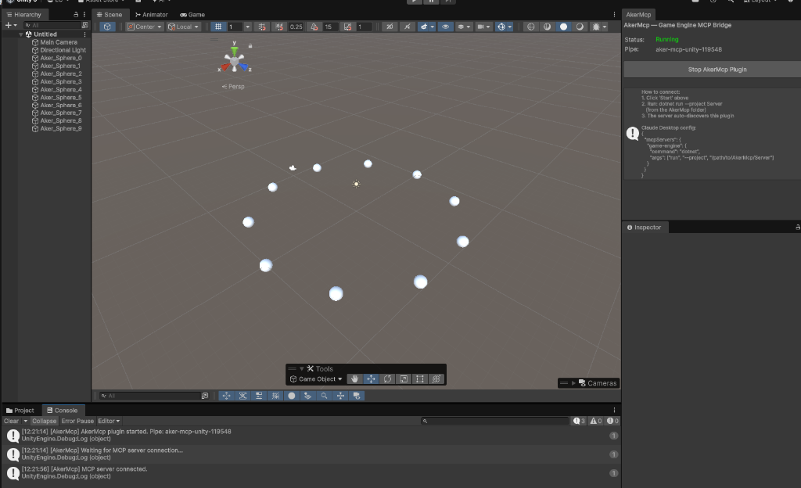

# AkerMCP


```text
                                         Aker (Egyptian: ꜣkr) was an
                                         ancient Egyptian earth god,
                                         often depicted as two lions
    /\__/\             /\__/\            seated back-to-back facing
  (  -.-  )          (  -.-  )           opposite horizons. Named
  >       <          >       <           Sef and Duau (Yesterday and
   /      )          (      \            Today), they guarded the
   \      /          \      /            passage of the sun through the
    | /    \        /    \ |             underworld, opening the gates
    | |    )|      |(    | |             for its safe transit.
  (___)  _//        \\_  (___)
       _\_/          \_/_                In this architecture, Aker
                                         serves as the unyielding
                                         bridge: one face speaking
                                         JSON-RPC to the LLM, the
                                         other manipulating the
                                         engine's main thread via IPC.
```

> **Give your AI Assistant (Claude, Cursor, Copilot, Antigravity) the power to directly manipulate any C# Game Engine.**

Traditionally, AI coding assistants can only suggest code for you to copy-paste. With **AkerMCP**, you grant your AI the ability to actually *see* and *touch* your game project in real-time. **AkerMCP is 100% C# engine-agnostic**—it works seamlessly with Unity, Godot, Stride, Flax Engine, or any custom C# engine simply by dropping in a lightweight adapter.

### 🪄 The "Wow" Factor: Talk to your Engine

Imagine asking your AI:
> *"Hey, make the Player character 20% bigger, turn all enemy materials red, and spawn 50 trees scattered across the ground plane."*

- **Without AkerMCP:** The AI writes a custom script, explains where to put it, you switch to Unity, attach it, press play, and hope it works.
- **With AkerMCP:** The AI just does it. Instantly. Right inside your Unity Editor. You watch the scene change before your eyes.

AkerMCP acts as a seamless bridge. It allows AI agents to inspect your scene hierarchy, modify GameObjects, and even execute complex procedural C# scripts on the fly. No more manual repetitive clicking in the inspector—just tell your AI what you want to achieve.

**Example:** *"Spawn 10 spheres in a circle with a radius of 10"*
```csharp
for (int i = 0; i < 10; i++) {
    float angle = i * Mathf.PI * 2 / 10f;
    Vector3 pos = new Vector3(Mathf.Cos(angle) * 10f, 0, Mathf.Sin(angle) * 10f);
    GameObject sphere = GameObject.CreatePrimitive(PrimitiveType.Sphere);
    sphere.transform.position = pos;
    sphere.name = $"Aker_Sphere_{i}";
}
```


*(Curious about the internal technical details? Jump to the [Architecture](#architecture) section).*

### 🔍 Real-World Debugging: The "Invisible" GPU Bug

To truly understand AkerMCP's power, consider a real session where a user's Voxel Ambient Occlusion (AO) was rendering completely flat, making caves far too bright.

- **Without AkerMCP:** The AI reads the shader and C# code, guesses what might be wrong, and suggests 5 different things to check manually. You recompile, run, guess, and iterate blindly for hours because the state lives entirely in GPU memory.
- **With AkerMCP:** 
  1. The AI uses `take_screenshot` to *see* that the AO debug view is entirely white.
  2. The AI uses the `execute` tool to run a C# script directly in the Editor, reading the 3D `RenderTexture` back to the CPU and counting the occupied voxels.
  3. The AI discovers that the base voxel grid has 29,000 solids, but the mipmap chain is completely empty.
  4. The AI pinpoints the exact line: `Graphics.CopyTexture` was being called incorrectly for a `Texture3D` volume (silently copying only depth-slice 0).

The AI found a subtle, data-dependent GPU bug in minutes because it could directly interrogate the engine's state and memory.

---

## 🦁 How it Works (Under the Hood)

Traditional MCP integrations for game engines ship 100+ hand-written tools — one per operation, one per component type. Every engine update breaks them.

AkerMCP replaces all of that with **14 generic tools** powered by runtime reflection and **Roslyn**. A single `set_property` tool can modify *any* property on *any* object in *any* engine, while the `execute` tool enables complex procedural generation via C# scripts. The `take_screenshot` tool closes the loop, giving the AI a way to *visually verify* what it just changed. The engine-specific adapter provides the necessary layer for interacting directly with the engine's API.

```
AI: "Set the player's position to (10, 0, 5)"

→ set_property {"object_path": "/Player", "property_path": "position", "value": {"x":10,"y":0,"z":5}}
← Property 'position' set successfully on /Player
```

No custom tool class needed. No code generation. Just reflection.

---

## Features

- **14 Generic Reflection-Based Tools**: Operate on any object or component without custom tool definitions.
- **Roslyn-Powered Dynamic Execution**: Send arbitrary C# scripts via the `execute` tool to perform complex procedural tasks or bulk operations directly within the Unity Editor.
- **Visual Verification (`take_screenshot`)**: Hybrid capture pipeline — engine-internal render-buffer capture when available (highest quality, works occluded), with **cross-platform OS-level fallback** (`PrintWindow` on Windows, Quartz `CGWindowListCreateImage` on macOS). Output is auto-resized and JPEG-encoded via ImageSharp to fit AI image limits.
- **MessagePack IPC Protocol**: High-performance, low-latency binary communication between the standalone MCP Server and the engine plugin.
- **Robust Type System**: Serializes and deserializes Unity-specific structs (`Vector3`, `Color`, `Bounds`) seamlessly.
- **Engine-Agnostic Core**: Shared .NET Standard 2.1 core makes it easy to port to Godot, Stride, Flax Engine, or other C# engines by writing a simple adapter.

---

## The Perfect Combo: AkerMCP + LynxMCP

AkerMCP gives your AI agent the hands to **manipulate the active scene** and execute runtime code. But to be truly effective, the AI also needs the brain to understand your entire project architecture and dependencies.

We highly recommend running AkerMCP alongside [**LynxMCP**](https://github.com/lorenzo-cambiaghi/LynxMCP), our local RAG (Retrieval-Augmented Generation) server designed for codebases. 

When combined, your AI gets a **complete global vision**:
- **LynxMCP** provides deep, semantic search over your custom C# scripts and up-to-date Unity/library documentation (feeding the AI with exact APIs and patterns it wouldn't otherwise know from its standard training data).
- **AkerMCP** uses that exact context to write and execute flawless Roslyn scripts directly in your Editor.

---

## Table of Contents

- [The Perfect Combo: AkerMCP + LynxMCP](#the-perfect-combo-akermcp--lynxmcp)
- [Prerequisites](#prerequisites)
- [Installation](#installation)
- [Unity Plugin Setup](#unity-plugin-setup)
- [Connecting an AI Client](#connecting-an-ai-client)
  - [Claude Code (CLI)](#claude-code-cli)
  - [Claude Desktop](#claude-desktop)
  - [Cursor](#cursor)
  - [Windsurf](#windsurf)
  - [VS Code + Copilot](#vs-code--copilot)
- [Verifying the Connection](#verifying-the-connection)
- [MCP Tools](#mcp-tools)
- [MCP Resources](#mcp-resources)
- [Type System](#type-system)
- [Example Session](#example-session)
- [Architecture](#architecture)
- [Writing an Engine Adapter](#writing-an-engine-adapter)
- [AI Integration Rules](#ai-integration-rules)
- [Troubleshooting](#troubleshooting)
- [License](#license)

---

## Quick Start (Recommended)

You do not need to install the .NET SDK or compile any code.

### Step 1 — Import the Unity Plugin
1. Go to the `Build/` folder in this repository.
2. Download `AkerMCP.unitypackage`.
3. Open your Unity project and double-click the package to import it.
   *(This package already contains all necessary C# scripts, dependencies, and Roslyn compilers).*

### Step 2 — Download the MCP Server
1. Go to the `Build/` folder.
2. Download the standalone server for your OS (e.g., `AkerMcp.Server-win-x64.zip` or `.tar.gz`).
3. Extract the archive anywhere on your computer.

---

## Advanced: Building from Source (For Developers)

If you want to modify AkerMCP or test the included Unity project, you'll need the **.NET 8.0+ SDK**.

### Step 1 — Clone and Build
```bash
git clone https://github.com/lorenzo-cambiaghi/AkerMCP.git
cd AkerMCP
dotnet build -c Release
dotnet publish Shared/AkerMcp.Shared.csproj -c Release -o .publish
```

### Step 2 — Unity Plugin Setup
If you are modifying the source code and want to push changes to your own Unity project:
1. Copy the `UnityTestProject/Assets/AkerMcp` folder into your own Unity project's `Assets/` folder.
2. Create `Assets/AkerMcp/Plugins/` and copy all `.dll` files from `.publish/` and `Client/bin/Release/netstandard2.1/`.
3. Copy the Unity Roslyn Compilers (`Microsoft.CodeAnalysis.dll`, etc.) from your Unity Editor installation (`.../Editor/Data/MonoBleedingEdge/lib/mono/4.5/`) into the `Plugins/` folder.

If you just want to run the included **UnityTestProject**, run `./copy-dlls.sh` (or `copy-dlls.bat` on Windows) to automatically build and copy all dependencies.

### Packaging a Release
Run `build-package.bat` (Windows) or `./build-package.sh` (Mac/Linux) to automatically compile the DLLs, export the Unity package, and publish the standalone MCP server binaries to the `Build/` folder.

### Step 2 — Open the Unity project

Open `UnityTestProject/` (or your own project) in **Unity Hub**.

### Step 3 — Create a test scene (optional)

Menu bar: **AkerMcp → Setup Test Scene**

This creates a scene with a Player (Rigidbody + Camera), three Enemies, a Ground plane, lights, and props — enough to test all tools.

### Step 4 — Start the plugin

Menu bar: **Window → AkerMcp**

Click **Start AkerMcp Plugin**.

You'll see a green **Running** status and a pipe name like `aker-mcp-unity-12345`. The plugin is now waiting for the MCP server to connect.

> **Tip:** The plugin must be running *before* you start the server. The server discovers it automatically via a lock file i## Connecting an AI Client

Point your AI client to the standalone executable you extracted in Step 2. 

> **Important:** Make sure the Unity plugin is running (green status in the AkerMcp window) before using any tools from the AI client.

### Claude Code (CLI)

```bash
claude mcp add game-engine -- /absolute/path/to/extracted/AkerMcp.Server
```

### Claude Desktop / Cursor / Windsurf

Open the MCP settings (or `claude_desktop_config.json`) and add the server:

```json
{
  "mcpServers": {
    "game-engine": {
      "command": "/absolute/path/to/extracted/AkerMcp.Server",
      "args": []
    }
  }
}
```

> **Windows users:** Replace the command path with the full Windows path to the `.exe`, for example `"C:\\Tools\\AkerMcp.Server\\AkerMcp.Server.exe"`. Remember to use double backslashes in JSON!

### Google Antigravity

Antigravity reads `mcp_config.json` from its user-data directory (`~/.gemini/antigravity/` or `%USERPROFILE%\.gemini\antigravity\`). Add:

```json
{
  "mcpServers": {
    "game-engine": {
      "command": "C:/Tools/AkerMcp.Server/AkerMcp.Server.exe",
      "args": [],
      "type": "stdio"
    }
  }
}
```

> *If you are a developer running from source, you can still use `"command": "dotnet"` and `"args": ["run", "--project", "/path/to/AkerMcp.Server"]` as shown in previous versions of this guide.*

---

## Verifying the Connection

Once both the Unity plugin and an AI client are running, you can verify the connection:

1. **In Unity** — the AkerMcp window should show **Running** (green)
2. **In the AI client** — ask the AI to use the `inspect` tool:

```
"Inspect the scene hierarchy"
```

You should get back a tree of GameObjects with their components:

```
Player  [Transform, Rigidbody]
  PlayerCamera  [Transform, Camera]
Enemy_1  [Transform, MeshFilter, MeshRenderer, BoxCollider, Rigidbody]
Enemy_2  [Transform, MeshFilter, MeshRenderer, BoxCollider, Rigidbody]
Ground  [Transform, MeshFilter, MeshRenderer, MeshCollider]
```

If you see this, everything is working.

---

## MCP Tools

### Scene Manipulation

| Tool | Description |
|------|-------------|
| `inspect` | Return components, properties, methods, and children of a scene object or type |
| `get_property` | Read a property via dot-notation path (e.g. `transform.position.x`) |
| `set_property` | Write a property — supports primitives, structs, arrays, nested objects |
| `call_method` | Invoke a method on a scene object or a static class method |
| `query` | Find objects by type name, name pattern, tag, or property values |
| `create` | Add a new object to the scene with optional initial properties |
| `delete` | Remove an object from the scene (supports undo) |
| `select` | Select a GameObject in the editor — highlights it in the Hierarchy and Inspector |
| `get_selection` | Get the currently selected object with its components, properties, and children |

### Development Workflow

| Tool | Description |
|------|-------------|
| `refresh_scripts` | Force script recompilation and return errors/warnings immediately |
| `get_compile_errors` | Retrieve compilation errors with file path, line, and column |
| `get_console_logs` | Read engine console entries with level and text filtering |
| `execute` | Run arbitrary C# code in the engine context (Roslyn) |

### Visual Verification

| Tool | Description |
|------|-------------|
| `take_screenshot` | Capture the editor's Game or Scene view and return a JPEG image to the AI |

#### How `take_screenshot` works

The tool follows a **hybrid capture strategy** that prefers quality but always succeeds:

1. **Engine-internal path** *(if the adapter implements `IScreenCapture`)* — captures directly from the render buffer. Works even when the editor window is occluded or partially off-screen. Highest quality.
2. **OS-level fallback** *(automatic, cross-platform on Windows + macOS)* — captures the engine's main window without stealing foreground focus. Works for any C# engine without requiring adapter code. Per-OS implementation is selected at runtime:
   - **Windows** — Win32 `PrintWindow(PW_RENDERFULLCONTENT)` via `user32.dll`
   - **macOS** — Quartz `CGWindowListCreateImage` via `CoreGraphics.framework` + `ImageIO.framework`. Window discovery: enumerates on-screen windows owned by the engine PID; among those, prefers any whose title contains the engine name (anywhere — matches both "Unity 6000…" and "… Godot Engine") and within that subset picks the largest by area. If no title contains the engine name, falls back to the largest PID-owned window
   - **Linux** — not implemented; the engine adapter must implement `IScreenCapture`

Output is automatically (cross-platform via ImageSharp):
- **Resized** to a maximum of 1920px on the longest side
- **Re-encoded as JPEG** (quality 85)

Typical output size: **~150-400 KB**, comfortably under Claude API image limits (~5 MB).

**Parameters:**

```json
{ "view": "game" }   // default — captures the Game View
{ "view": "scene" }  // captures the active Scene View (Unity)
```

**Example:**

```
→ set_property {"object_path": "/Player", "property_path": "Light.color", "value": {"r":1,"g":0,"b":0,"a":1}}
← Property 'Light.color' set successfully on /Player

→ take_screenshot {"view": "scene"}
← [JPEG image, 1920×1080, 287 KB]   // AI now sees the red light
```

#### macOS: Screen Recording permission

On macOS 10.15+, capturing windows from another process requires **Screen Recording permission** for the binary running the AkerMcp server. This affects only the OS-level fallback path — adapters implementing `IScreenCapture` (like the Unity adapter) work without any permission grant.

**First-time setup:**

1. The first time the OS-level fallback is invoked, macOS shows a permission prompt for the binary running the server (typically `dotnet`).
2. If you miss the prompt or denied it, open: **System Settings → Privacy & Security → Screen Recording**
3. Add (or enable the toggle for) the binary running AkerMcp:
   - If you launch via `dotnet run --project Server` → the entry is `dotnet` (or `dotnet [version]`)
   - If you ship a self-contained build → the entry is your published executable
4. **Restart the server.** macOS caches the denial decision until the process restarts — granting alone is not enough.

**Verification:**

```bash
# Trigger a screenshot from your AI client. If permission is missing, the tool returns:
#   "macOS denied the screen capture (CGWindowListCreateImage returned NULL)..."
# Follow the steps above and try again after restarting the server.
```

**Why no permission is needed for Unity (and most engines):** The Unity adapter implements `IScreenCapture` using its own Camera/SceneView render buffer. That happens entirely *inside* the Unity process, so macOS doesn't treat it as cross-process screen capture and no permission is required. Only when no adapter capture exists does AkerMcp fall back to the OS-level path that triggers the permission flow.

### Dynamic Code Execution (`execute`)

The `execute` tool runs arbitrary C# code inside the Unity Editor using Roslyn (`Microsoft.CodeAnalysis.CSharp.Scripting`). This is the most powerful tool — it can do anything the Unity Editor API allows.

**What it enables:**

- Procedural scene generation (spawn 100 objects in a grid, create terrain, etc.)
- Bulk property modifications across many objects
- Asset manipulation (create materials, import textures, modify prefabs)
- Complex queries that go beyond what `query` supports
- Editor automation (menu items, build pipeline, custom importers)
- Anything you can do in a Unity Editor script

**Built-in globals** available in your code:

| Global | Type | Description |
|--------|------|-------------|
| `selectedObject` | `GameObject?` | Currently selected GameObject in the editor |
| `Find(name)` | `GameObject?` | Shortcut for `GameObject.Find(name)` |
| `FindAll<T>()` | `T[]` | Find all objects of type T |
| `Create(name)` | `GameObject` | Create a new empty GameObject |
| `Log(message)` | `void` | Log to the Unity console |

**Imported namespaces** (no `using` needed): `System`, `System.Collections.Generic`, `System.Linq`, `UnityEngine`, `UnityEditor`

**Examples:**

```csharp
// Create a grid of cubes
for (int x = 0; x < 5; x++)
    for (int z = 0; z < 5; z++) {
        var cube = GameObject.CreatePrimitive(PrimitiveType.Cube);
        cube.name = $"Cube_{x}_{z}";
        cube.transform.position = new Vector3(x * 2, 0, z * 2);
    }
```

```csharp
// Set all enemies to red
var enemies = FindAll<Renderer>()
    .Where(r => r.gameObject.name.StartsWith("Enemy"))
    .ToArray();
foreach (var r in enemies)
    r.material.color = Color.red;
return $"Colored {enemies.Length} enemies";
```

```csharp
// Return scene stats
var objects = FindAll<GameObject>();
var types = objects
    .SelectMany(go => go.GetComponents<Component>())
    .Where(c => c != null)
    .GroupBy(c => c.GetType().Name)
    .Select(g => $"{g.Key}: {g.Count()}")
    .ToArray();
return string.Join("\n", types);
```

> **Note:** The script state persists between calls — variables defined in one `execute` call are available in the next. The evaluator runs on Unity's main thread with full Editor API access.

### How property paths work

Properties are accessed via **dot-notation paths** resolved at runtime through reflection:

```
transform.position.x          → float
Rigidbody.mass                → float (targets a specific component)
MeshRenderer.material.color   → Color
```

When a property name is ambiguous (e.g. `enabled` exists on multiple components), prefix it with the component type: `Rigidbody.enabled`, `MeshRenderer.enabled`.

---

## MCP Resources

| URI | Description |
|-----|-------------|
| `scene://hierarchy` | Full scene tree with components listed per object |
| `project://info` | Engine name/version, project path, active scene |
| `editor://logs` | Recent console entries |
| `editor://compile_status` | Compilation status, error/warning counts |
| `engine://types` | Registered engine type names |

---

## Type System

The serializer converts between JSON and .NET types via reflection. It handles:

- **Primitives** — `int`, `float`, `double`, `bool`, `string`, `enum`
- **Structs** — any value type, constructed from JSON via field/property matching
- **Arrays** — `T[]` from JSON arrays
- **Lists** — `List<T>` from JSON arrays
- **Dictionaries** — `Dictionary<string, T>` from JSON objects
- **Nested types** — recursive resolution (e.g. `Bounds` containing `Vector3` fields)
- **Nullable** — automatic unwrap

The Unity adapter registers optimized converters for:

```
Vector2  Vector3  Vector4  Vector2Int  Vector3Int
Quaternion  Color  Color32  Rect  RectInt
Bounds  BoundsInt  LayerMask
```

JSON examples:

```json
{ "x": 1.0, "y": 2.0, "z": 3.0 }                                              // Vector3
{ "r": 0.5, "g": 0.0, "b": 1.0, "a": 1.0 }                                    // Color
{ "center": { "x": 0, "y": 0, "z": 0 }, "size": { "x": 10, "y": 10, "z": 10 }} // Bounds
[{ "x": 0, "y": 0, "z": 0 }, { "x": 1, "y": 1, "z": 1 }]                      // Vector3[]
```

---

## Example Session

```
→ inspect {"target": "/Player"}
← {
    "typeName": "Rigidbody",
    "path": "/Player",
    "components": [
      {"name": "Transform", "enabled": true},
      {"name": "Rigidbody", "enabled": true}
    ],
    "properties": [
      {"name": "position", "type": "Vector3", "value": {"x":0,"y":1,"z":0}},
      {"name": "Rigidbody.mass", "type": "float", "value": 1.0},
      ...
    ],
    "childNames": ["PlayerCamera"]
  }

→ select {"object_path": "/Player/PlayerCamera"}
← {"selected": true, "path": "/Player/PlayerCamera", "name": "PlayerCamera",
    "components": [{"name":"Transform"}, {"name":"Camera"}]}

→ set_property {
    "object_path": "/Player",
    "property_path": "position",
    "value": {"x": 10, "y": 0, "z": 5}
  }
← Property 'position' set successfully on /Player

→ query {"type_filter": "Camera"}
← [{"path": "/Player/PlayerCamera", "type": "Camera", "name": "PlayerCamera"}]

→ refresh_scripts {}
← Recompilation requested. Status: idle
  Last compile: 14:32:05
  Result: SUCCESS
  No errors or warnings.

→ get_console_logs {"level_filter": "error", "count": 10}
← (No matching log entries)
```

---

## Architecture

```
                  ┌──────────────────────┐
                  │  LLM (Claude, etc.)  │
                  └──────────┬───────────┘
                             │ JSON-RPC 2.0 / stdio
                  ┌──────────▼───────────┐
                  │    AkerMCP Server    │   .NET 8 console process
                  │   14 MCP tools       │
                  │    5 MCP resources   │
                  └──────────┬───────────┘
                             │ Named Pipe + MessagePack
                  ┌──────────▼───────────┐
                  │   Engine Plugin      │   runs inside Unity / Godot / Stride / Flax
                  │   ISceneGraph impl   │
                  └──────────────────────┘
```

| Project | Target | Description |
|---------|--------|-------------|
| `AkerMcp.Shared` | netstandard2.1 | Protocol models, engine abstractions, reflection engine, serialization, IPC |
| `AkerMcp.Server` | net8.0 | MCP server — JSON-RPC over stdio, routes tool calls to the engine plugin |
| `AkerMcp.Client` | netstandard2.1 | Plugin base class — runs inside the engine, handles IPC and main-thread dispatch |

### How it works

1. The **engine plugin** starts a named-pipe server and writes a lock file to the system temp directory.
2. The **MCP server** scans for lock files, connects to the pipe, and begins forwarding tool calls.
3. The **LLM** sends JSON-RPC requests over stdio. The server forwards them to the engine plugin via MessagePack IPC and returns results as JSON.
4. The **engine plugin** dispatches requests to the main thread, executes reflection-based operations through `ISceneGraph`/`ISceneNode`, and returns results.

Property paths like `transform.position.x` are resolved at runtime by `PropertyPathResolver`, which walks the object graph via cached reflection metadata. Struct value-type propagation is handled automatically.

### Project structure

```
AkerMCP/
├── AkerMcp.sln
├── Shared/                              AkerMcp.Shared (netstandard2.1)
│   ├── Protocol/                        JSON-RPC and MCP message models
│   ├── Abstraction/                     Engine-agnostic interfaces
│   ├── Reflection/                      PropertyPathResolver, inspector, cache
│   ├── Serialization/                   GenericSerializer, TypeRegistry
│   └── Ipc/                             Named pipe channel, binary framing
├── Server/                              AkerMcp.Server (net8.0 console app)
│   ├── McpServer.cs                     JSON-RPC dispatcher, MCP lifecycle
│   ├── ToolRegistry.cs                  14 generic tool definitions
│   ├── ResourceRegistry.cs              5 resource definitions
│   ├── EngineConnection.cs              IPC client to engine plugin
│   ├── StdioTransport.cs                stdin/stdout transport
│   ├── ImageProcessor.cs                Resize + JPEG normalization (cross-platform via ImageSharp)
│   └── Platform/                        OS-level window capture
│       ├── IPlatformScreenCapture.cs    Common interface
│       ├── PlatformScreenCapture.cs     Runtime OS-based factory
│       ├── Windows/
│       │   └── WindowsScreenCapture.cs  Win32 PrintWindow + GDI+
│       └── Mac/
│           └── MacScreenCapture.cs      Quartz CGWindowListCreateImage + ImageIO P/Invoke
├── Client/                              AkerMcp.Client (netstandard2.1)
│   ├── EnginePluginBase.cs             Abstract base for adapters
│   ├── IpcRequestHandler.cs            Request routing and execution
│   ├── PluginDiscovery.cs              Lock-file based auto-discovery
│   ├── MainThreadDispatcherBase.cs     Thread-safe queue with TCS pattern
│   └── ClientConfiguration.cs          Client-side settings
└── UnityTestProject/                    Unity 6 test project
    └── Assets/AkerMcp/                  Unity adapter implementation
        ├── UnitySceneGraph.cs           Scene traversal and node creation
        ├── UnitySceneNode.cs            Reflection wrapper for GameObjects
        ├── UnityTypeRegistration.cs     MessagePack types and aliases
        └── Editor/                      Editor-only tooling
            ├── DynamicEvaluator.cs      Roslyn-powered C# execution engine
            ├── McpEditorWindow.cs       Unity Editor UI for MCP server
            ├── UnityCompilationSupport.cs Script compilation tools
            ├── UnityEditorContext.cs    Active selection and console logs
            ├── UnityMainThreadDispatcher.cs Unity main thread marshalling
            ├── UnityScreenCapture.cs    Game/Scene view render-buffer capture
            └── UnityMcpPlugin.cs        Plugin entry point
```

---

## Writing an Engine Adapter

To support a new engine (e.g. Godot, Stride, Flax), subclass `EnginePluginBase` and implement the required interfaces:

```csharp
public class MyEnginePlugin : EnginePluginBase
{
    // Required
    protected override ISceneGraph CreateSceneGraph() => new MySceneGraph();
    protected override IEngineCapabilities CreateCapabilities() => new MyCapabilities();
    protected override IMainThreadDispatcher CreateDispatcher() => new MyDispatcher();

    // Optional
    protected override IEditorContext? CreateEditorContext() => new MyEditorContext();
    protected override IAssetManager? CreateAssetManager() => null;
    protected override ICompilationSupport? CreateCompilationSupport() => new MyCompilationSupport();
    protected override IScreenCapture? CreateScreenCapture() => new MyScreenCapture();

    protected override void Log(string message) { /* ... */ }
    protected override void LogError(string message) { /* ... */ }
}
```

| Interface | Purpose | Required |
|-----------|---------|:--------:|
| `ISceneGraph` | Scene tree traversal, create/delete, query | Yes |
| `ISceneNode` | Property get/set, method invocation, component listing | Yes |
| `IEngineCapabilities` | Type resolution, engine metadata | Yes |
| `IMainThreadDispatcher` | Marshal actions to the engine's main thread | Yes |
| `IEditorContext` | Selection, scene management, console logs | No |
| `IAssetManager` | Asset search, load, save, delete | No |
| `ICompilationSupport` | Script recompilation, error retrieval | No |
| `IScreenCapture` | Engine-internal render-buffer capture (Game/Scene view) | No — falls back to OS-level capture on Windows (`PrintWindow`) and macOS (Quartz). On Linux, this interface is required |

> **Tip for the macOS OS-level fallback:** `IEngineCapabilities.EngineName` is used as a window-title preference signal — the macOS capture path prefers PID-owned windows whose title *contains* this string (anywhere in the title) to disambiguate the editor's main window from inspector/floating panels. The match is case-insensitive and works for both prefix-style titles (Unity: `"Unity 6000.x …"`) and suffix-style titles (Godot: `"Scene - Project - Godot Engine"`). If no window matches, the largest PID-owned window is used as a fallback, so even a non-matching `EngineName` won't break the capture.

Register custom type converters for engine-specific structs:

```csharp
TypeRegistry.Instance.RegisterCustomSerializer<Vector3>(
    v => new Dictionary<string, object?> { ["x"] = v.x, ["y"] = v.y, ["z"] = v.z },
    d => new Vector3(F(d, "x"), F(d, "y"), F(d, "z"))
);
```

---

## AI Integration Rules

AkerMCP embeds comprehensive usage instructions **directly into each tool's description** served via the MCP protocol. This means any AI client (Claude, Cursor, Copilot, Antigravity) automatically learns how to use all 14 tools correctly — including property path syntax, the Inspect → Modify → Verify workflow, Roslyn execution globals, compilation verification, and visual verification via screenshots — **with zero configuration**.

### Optional: Boost with a rules file

For even better results, you can add a rules file to your project root. This reinforces the built-in instructions and gives the AI additional context about common workflows and anti-patterns.

| Platform | File | Scope |
|----------|------|-------|
| Claude Code | `CLAUDE.md` (project root) | Per-project |
| Antigravity | `AGENTS.md` (project root) | Per-project |
| Cursor | `.cursor/rules/AkerMCP.md` | Per-project |
| Cross-tool | `AGENTS.md` (project root) | Works with most clients |

> **Recommended:** Use `AGENTS.md` in your project root. It's the most widely supported convention.

### Rules template

Copy everything inside the block below into your rules file:

---

<details>
<summary><strong>Click to expand the full rules template</strong></summary>

```markdown
<agent_instructions>

#### AkerMCP — AI Integration Rules

You have access to a Unity (or Godot, Stride, Flax) game engine via the `game-engine` MCP server. This gives you 14 tools to inspect, query, modify, script, and visually verify the active scene — all from the editor.

#### Available Tools (quick reference)

| Tool | Use when... |
|------|-------------|
| `inspect` | You need to see what's on a GameObject — components, properties, children |
| `get_property` | You know the exact path and want a single value |
| `set_property` | You want to change one property with undo support |
| `call_method` | You need to invoke a method (e.g. `SetActive`, `AddForce`) |
| `query` | You need to find objects by type, name pattern, or tag |
| `create` | You need to add a new GameObject to the scene |
| `delete` | You need to remove a GameObject (destructive, has undo) |
| `select` | You want to highlight an object in Unity's Hierarchy/Inspector |
| `get_selection` | You want to know what the user currently has selected |
| `refresh_scripts` | You just wrote or modified a `.cs` file and need to trigger recompilation |
| `get_compile_errors` | You need to check if scripts compiled successfully |
| `get_console_logs` | You need to read runtime errors, warnings, or debug output |
| `execute` | You need to run arbitrary C# code (procedural generation, bulk ops, complex logic) |
| `take_screenshot` | You need to **see** the result of a change (placement, materials, lighting, UI) |

#### Core Workflow: Inspect → Modify → Verify

Always follow this pattern:

1. **Inspect first.** Before modifying anything, call `inspect` to see the object's components, properties, and current values. Never guess.
2. **Modify.** Use `set_property` for single changes, `execute` for complex operations.
3. **Verify.** Call `get_property` or `inspect` again to confirm the change took effect. Check `get_console_logs` if something seems wrong.
4. **Visually verify (when relevant).** For changes that affect what the user *sees* — placement, materials, lighting, UI layout, scale — call `take_screenshot` after the change to confirm the result looks right. This catches problems that property values alone cannot reveal (e.g. an object placed inside another, a material that compiled but renders pink, a UI element clipped off-screen).

```
Bad:  set_property "/Player" "mass" 5        ← "mass" might not resolve (it's on Rigidbody)
Good: inspect "/Player" → see "Rigidbody.mass" exists → set_property "/Player" "Rigidbody.mass" 5
```

#### Property Path Syntax

Properties use **dot-notation** resolved via reflection:

```
position                → Transform.position (Transform is searched first)
position.x              → float
Rigidbody.mass          → targets the Rigidbody component specifically
Rigidbody.useGravity    → bool
MeshRenderer.material.color → Color
```

**Rules:**
- Transform properties (`position`, `rotation`, `localScale`, `eulerAngles`) don't need a prefix
- Other components need the type prefix: `Rigidbody.mass`, `Camera.fieldOfView`, `Light.intensity`
- Nested properties work: `MeshRenderer.material.color.r`
- Array indexing works: `mesh.vertices[0]`

**Structs are passed as JSON objects:**
```json
{"x": 1.0, "y": 2.0, "z": 3.0}           // Vector3
{"r": 1.0, "g": 0.0, "b": 0.0, "a": 1.0} // Color
```

#### When to Use `execute` vs Other Tools

| Scenario | Use |
|----------|-----|
| Change one property | `set_property` |
| Read one value | `get_property` |
| Find objects | `query` |
| Create one object | `create` |
| Modify 10+ objects in a loop | `execute` |
| Generate procedural content | `execute` |
| Access Editor API (AssetDatabase, Undo groups, etc.) | `execute` |
| Complex conditional logic | `execute` |
| Create materials, shaders, ScriptableObjects | `execute` |
| Confirm a visual change actually looks right | `take_screenshot` |
| Show the user what the scene currently looks like | `take_screenshot` |

#### Writing `execute` Scripts

**Available globals** (no setup needed):

```csharp
selectedObject              // Currently selected GameObject (or null)
Find("Player")              // GameObject.Find shortcut
FindAll<Rigidbody>()        // Find all components of a type
Create("MyObject")          // Create empty GameObject
Log("message")              // Debug.Log shortcut
```

**Pre-imported namespaces**: `System`, `System.Collections.Generic`, `System.Linq`, `UnityEngine`, `UnityEditor`

**State persists between calls.** Variables you define in one `execute` are available in the next:

```csharp
// Call 1
var player = Find("Player");
// Call 2
return player.transform.position;  // still accessible
```

**Return values** are sent back to you. Always `return` a meaningful result:

```csharp
// Good — returns useful info
var count = FindAll<Rigidbody>().Length;
return $"Found {count} rigidbodies";

// Bad — no feedback
FindAll<Rigidbody>();  // returns null, you won't know the result
```

**Timeout**: Default is 5 seconds. Pass `timeout_ms` for longer operations.

#### Visual Verification with `take_screenshot`

Use it whenever the user asks "how does it look?", "did it work?", or after making any change that has a **visual outcome**:

| Situation | Should you screenshot? |
|-----------|------------------------|
| Moved/created/deleted an object | ✅ Yes — confirm placement |
| Changed a material, color, or texture | ✅ Yes — colors can fail silently (pink fallback shaders) |
| Modified lighting | ✅ Yes — intensity/color changes are hard to predict numerically |
| Modified UI layout | ✅ Yes — anchoring/scaling bugs are visual-only |
| Spawned procedural content | ✅ Yes — verify the generation looks reasonable |
| Changed a non-visual property (mass, tag, name, layer) | ❌ No — `get_property` is enough |
| Wrote a script | ❌ No — use `get_compile_errors` instead |

**Parameters:**

```json
{ "view": "game" }   // default — Game View, what the player sees
{ "view": "scene" }  // Scene View, useful for inspecting the full editor with gizmos
```

Output is a JPEG (~150-400 KB, max 1920px). You'll receive it as an image content block — read it like any other image.

**Pattern: change → screenshot → react**

```
→ execute "for (int i = 0; i < 50; i++) { var t = GameObject.CreatePrimitive(PrimitiveType.Cube); t.transform.position = new Vector3(Random.Range(-20,20), 0, Random.Range(-20,20)); t.name = $\"Tree_{i}\"; } return \"spawned 50\";"
← spawned 50

→ take_screenshot {"view": "scene"}
← [JPEG image]
   ← AI sees: cubes are clustered too tightly in one corner — distribution looks wrong
   → Fixes the script and re-runs.
```

**Don't screenshot for every micro-change.** It's not free — the AI client renders the image and consumes context. Use it at the end of a logical edit, not after each `set_property` in a sequence.

#### After Writing or Modifying C# Scripts

Whenever you create or edit a `.cs` file in the Unity project:

1. Call `refresh_scripts` — this forces Unity to recompile
2. Call `get_compile_errors` — check for errors
3. If errors exist, fix them and repeat

```
→ refresh_scripts {}
← Recompilation requested. Result: FAILED
  === ERRORS (1) ===
  Assets/Scripts/Player.cs(15,9): error CS1002: ; expected

→ (fix the file)

→ refresh_scripts {}
← Result: SUCCESS. No errors or warnings.
```

**Never assume a script change compiled successfully.** Always verify.

#### Scene Navigation

**Paths** use forward slashes from the scene root:

```
/Player
/Player/PlayerCamera
/Environment/Trees/Oak_01
```

**To find objects** when you don't know the path:
- `query {"name_pattern": "Player*"}` — glob search
- `query {"type_filter": "Camera"}` — by component type
- `query {"tag": "Enemy"}` — by tag

**To explore the full scene:**
- Read the `scene://hierarchy` resource — returns the complete tree with components
- Or call `inspect` on root objects

#### Anti-Patterns

| Don't | Do instead |
|-------|------------|
| Guess property names | `inspect` the object first |
| Modify without inspecting | Inspect → modify → verify |
| Use `execute` for one property change | `set_property` (supports undo) |
| Ignore compile errors after writing scripts | `refresh_scripts` → `get_compile_errors` |
| Assume paths are case-insensitive | They're case-sensitive on the engine side |
| Create complex objects one property at a time | Use `execute` with a single script |
| Forget to `return` values in `execute` | Always return a string describing what happened |
| Screenshot after every micro-change | Screenshot once at the end of a logical edit |
| Trust property values alone for visual changes | `take_screenshot` to confirm the actual rendered result |

#### Error Recovery

If a tool call fails:

1. **Read the error message** — it usually tells you exactly what's wrong
2. **Inspect the target** — the object may not exist, or the property name may be different
3. **Check the console** — `get_console_logs {"level_filter": "error"}` shows runtime errors
4. **For compile errors** — `get_compile_errors` shows the exact file, line, and column

</agent_instructions>
```

</details>

---

## Troubleshooting

**The server says "No engine plugin discovered"**

The Unity plugin must be started *before* the MCP server. Open **Window → AkerMcp** in Unity and click **Start** first.

**Unity shows DLL loading errors**

Make sure you copied *all* DLLs from the `.publish/` folder, including `System.Text.Json.dll`. Unity does not ship this library by default.

**Property not found on component**

Prefix the property with the component type name: `Rigidbody.mass` instead of just `mass`. This disambiguates when multiple components share property names.

**The first server start is slow**

`dotnet run` compiles the server on first launch. Subsequent starts are fast. You can also use `dotnet build -c Release` ahead of time, then run the compiled binary directly:

```bash
./Server/bin/Release/net8.0/AkerMcp.Server
```

**Connection drops after Unity recompiles scripts**

Domain reload in Unity tears down the plugin to safely release file locks. Re-click **Start** in the AkerMcp window after a recompile. The MCP server features an infinite background retry loop and will automatically detect the new instance and reconnect—you do **not** need to restart the server.

**macOS: `take_screenshot` returns "macOS denied the screen capture"**

Only happens when the OS-level fallback is used (engine adapter doesn't implement `IScreenCapture`). Open **System Settings → Privacy & Security → Screen Recording**, enable the entry for the binary running the server (typically `dotnet`), then **restart the server** — macOS caches the denial decision until the process restarts. See [macOS: Screen Recording permission](#macos-screen-recording-permission) for the full procedure.

**macOS: `take_screenshot` returns "No on-screen window found for PID"**

Only happens with the OS-level fallback. The engine's main window cannot be located via title prefix. Verify that `IEngineCapabilities.EngineName` in your adapter matches the actual editor window title prefix (e.g. `"Unity"` for Unity Editor). The match is case-insensitive but must be a prefix.

**Unity says "Opening file failed: Access is denied"**

If you downloaded the repository as a ZIP or cloned it on Windows, Unity might complain about `.asset` or `.meta` files being read-only. To fix this:
1. Right-click the `UnityTestProject` folder in Windows Explorer.
2. Go to **Properties**.
3. Uncheck the **Read-only** box and click Apply (apply to all folders, subfolders, and files).
Alternatively, open Command Prompt and run: `attrib -R "UnityTestProject\*.*" /S /D`

---

## License

[Apache 2.0](LICENSE)
